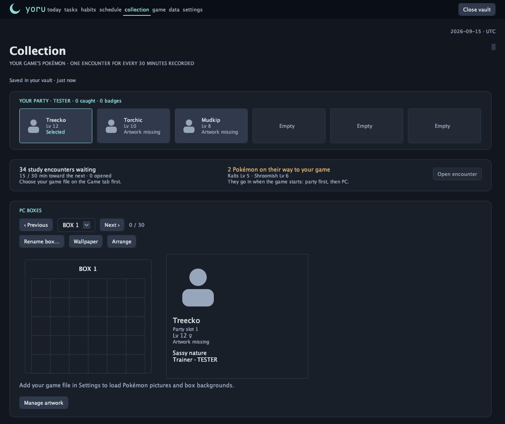
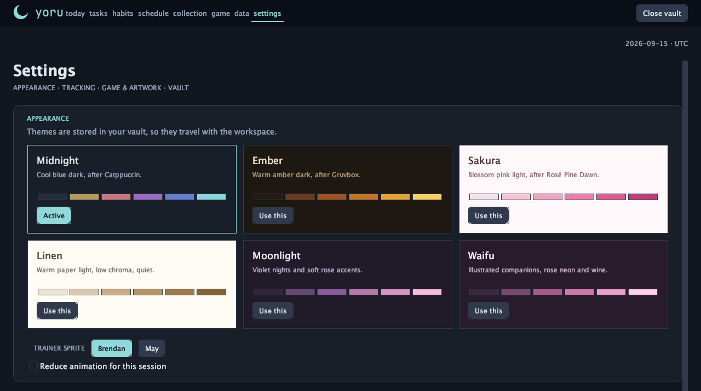

# Yoru / 夜

A local-first desktop study workspace that plays Pokémon Emerald with you:
study time earns encounters, and the Pokémon you catch go into the game.

No account, no server, no sync. Everything lives in an encrypted vault on your
own machine, and the study tools work with no game files at all.

---

## The loop

**Study → earn encounters → play the game.** That is the whole idea. Yoru
replaces the repetitive parts of the game — walking through grass for hours,
grinding levels — with the studying you were going to do anyway, and leaves the
story, the battles and the progression intact.

### 1. Study

Everything a study session needs, and nothing that gets in the way:

- **Timer** — open-ended clock in/out, with no forced pomodoro. A running timer
  survives closing the app, and a forgotten clock-out can be corrected.
- **Tasks** — a local inbox with due dates, statuses, class tags, sorting,
  drag-to-reorder and a month calendar. Tasks can be pasted in from an AI
  proposal, or imported from a Notion export.
- **Schedule** — a real week grid with plan and actual lanes. Drag on empty
  space to create, drag to move, drag the edges to resize, and repeat a block
  weekly.
- **Habits** — daily check-offs with streaks, an editable 28-day history, and
  "time since" trackers for something you have quit.
- **Analytics** — a 52-week heat map whose tiers scale to *your* daily goal, a
  rainbow tier for days that beat it, and a breakdown of where your time went.
- **Study music** — while the timer runs, Yoru plays the WAV, AIFF or AU files
  you imported yourself, because the JDK ships no MP3 decoder. See
  [Study music](#study-music) below.
- **A study buddy** — the lead of your game's party sits beside the timer,
  animating while you record, and the card keeps the time you have studied
  together.

### 2. Earn encounters

Recorded study time earns encounters at a fixed rate — one for every thirty
minutes, so a long session earns several and short sessions accumulate. What
appears is not random noise: Yoru reads the wild tables from the player's own
game, so an encounter is always something that place could really have offered
at that point in the story, at a level from that area's own range. Badges open
up new places, exactly as they do in the game.

An encounter is decided in advance and never rerolls — closing the encounter
screen and opening it again shows the same Pokémon.

### 3. Play

The **Game** tab is the game itself, running inside Yoru. Press Play and it
opens with your save; it keeps running while you switch to other tabs, and
Close returns the party, PC and progress to your vault.

Study-earned Pokémon are delivered into the game's own save — the party first,
then the PC — in one crash-safe write, at Play and again at Close. What you
catch in the game comes back to Yoru the same way. Battles are the game's own,
with its own rosters, moves, items and rules.

> Yoru's study tools and game integration are in place and in daily use. The
> v1.0 release plan — and what is still open before the tag — is tracked in the
> [roadmap](docs/ROADMAP.md) and [current development status](docs/CURRENT-STATE.md).

---

## Study tools

The tracker is a complete application on its own. It never asks for a game
file, and every page below works whether or not you have one.

### Timer and analytics

An open-ended clock with no forced pomodoro. Clock in, clock out, and correct
either afterwards; sessions under a configurable minimum are recorded but earn
nothing, so the totals and the reward economy can never disagree. Track as many
activities as you like — the heat map totals them all and each one separately.
A running timer survives closing the app, and a session recovered when the
vault opens still starts the right music.

Analytics shows a 52-week heat map whose tiers scale to your own daily goal,
with a rainbow tier for days that beat it, and a breakdown of where the week
actually went.

### Tasks

A local inbox with due dates, a status that cycles TODO → DOING → DONE,
coloured class tags, four sort orders and manual drag-to-reorder, plus a month
calendar you can drag a task onto to reschedule it. Two import paths keep
typing to a minimum:

- **Paste a proposal** from an AI chat into an editable review table and keep
  only what you want. This happens entirely locally.
- **Import a Notion export** — Yoru reads the export's own format and shows the
  same review before anything is added.

### Schedule

A real week grid with hour rules, a column per day and a now-line. Recorded
sessions render where they actually happened; planned blocks render as outlines
behind them. Drag on empty space to create, drag to move across days, drag the
edges to resize, and repeat a block weekly. The week starts on the day you
choose.

### Habits

Daily check-offs with streaks and an editable 28-day history, plus "time since"
trackers for something you have quit — with a backdatable start and restarts
that keep the earlier periods instead of erasing them.

### Study music

While the timer runs, Yoru plays the WAV, AIFF and AU files you imported
yourself — the three formats the JDK decodes. MP3, M4A, FLAC and OGG are
rejected at import rather than failing silently mid-session. Enabled state and
volume live per machine, not in the vault: which speakers are attached is a
fact about this computer.

Nothing plays unless you switch it on.

### Study buddy

The buddy card beside the timer is the lead of your game's party — whoever you
put first in the save — drawn from your own artwork if you have supplied any,
with its National Dex number if you have not. It animates while you are
recording, and the card carries the time you have studied together, how close
the next encounter is, and a shortcut into the game or the collection.

---

## The Game tab

**Yoru ships no game, no BIOS, no artwork and no music.** You supply your own,
and they stay on your machine:

- **Your own game file**, from your own legally obtained copy.
- **[RetroArch](https://www.retroarch.com/)** — Yoru is its own libretro
  frontend and never launches RetroArch, but when an installation is present it
  reuses that installation's mGBA core, BIOS folder and core options.
- **The [mGBA libretro core](https://mgba.io/)** — RetroArch's core downloader
  installs it, or point Yoru at one you have.

The Game tab finds these on first use and says what it is missing. A missing
core or game file never blocks the study workspace: every other tab works with
no game files at all.

**The save is the collection.** There is no starter picker and no separate
tracker roster: the party and the PC you see are read from the game's own save
(vault schema 11). While the game is closed you can rearrange Pokémon between
boxes and the party, rename boxes and change wallpapers from Yoru, through the
same verified, backed-up transaction that delivery uses. The game and the
tracker never write at the same time — the controls disable while the game runs.

Each vault keeps its own game save, so two workspaces never share a journey.

Artwork is optional too. Import your supported Emerald `.gba` or `.zip` to extract
all normal/shiny sprites and PC wallpapers locally. Settings → **Extract from
current game** repairs artwork for a game you already chose. You can also drop
in a folder or a `.zip` of your own PNGs, or use
**Collection → Choose local artwork folder**; without it, the collection shows
National Dex numbers instead.

---

## Screenshots

Rendered by `dev.yoru.ui.Preview` from invented sample data, with no game
artwork installed, which is why pictures read "Artwork missing". Yoru draws its
own interface, artwork and logo — no game screenshots, and no game art anywhere
in this repository.

**Today** — the focus timer and walking scene, your partner, today's plan and totals.


**Schedule** — the week grid, with plan and actual lanes side by side.


**Tasks** — a table, with views for due today, the next five days and a month calendar.


**Heat map** — 52 weeks of recorded time, coloured against your daily goal.


**Collection** — your party, study encounters and PC boxes, read from the game's own save.



**Settings** — six themes, each shown in its own colours.



---

## Quick start

### Install a release

Tagged releases carry installers built with `jpackage`, each with its own Java
runtime, so there is nothing else to install:

- **macOS** — the `.dmg`, for Apple silicon. Open it and drag Yoru into
  Applications.
- **Windows** — the `.msi`. Double-click; no admin rights needed.
- **Linux** — the `.deb`, for 64-bit Intel and AMD. Install it with
  `sudo apt install ./<the file you downloaded>`.

The macOS build is not signed with a paid Apple Developer certificate, so
macOS cannot verify who built it the first time you open it. That is expected,
and it does not mean the download is damaged. Open it once with
**Control-click → Open**, then **Open** again in the dialog — or allow it from
**System Settings → Privacy & Security → Open Anyway**. After that it opens
like any other app. The whole source is right here if you would rather build it
yourself.

### Updating

From 1.0.5, **Settings → Updates → Check for updates** asks GitHub for the newest
release, only when you press it. On a Mac, Yoru downloads the `.dmg`, checks it
against the release's SHA-256, then closes your game and vault, replaces itself
and reopens. On Windows it runs the verified `.msi` after closing. On Linux it
verifies the `.deb` and gives you the one `sudo apt install` command to run.
Earlier versions have no updater, so install 1.0.5 by hand once. Your workspace
stays as it is.

### Run from source

**Requires JDK 22 or later.** Swing and the JDK only — no runtime dependencies,
no build system, no network access.

```bash
./run.sh      # build and launch
./build.sh    # compile and jar only
./test.sh     # the whole suite, headless
```

On Windows: `build.cmd`, then `java -jar build/yoru.jar`.

On first launch, create a workspace. A password is optional — without one, a
random key is written next to the vault, which is convenience rather than
protection. Vaults are names in a folder you choose: create, open, rename,
switch and delete all happen in the app, and nothing asks you to hunt for a
file. See [SECURITY.md](SECURITY.md) for what the vault does and does not
protect.

### Build

```bash
git clone <this repository>
cd yoru
./build.sh          # javac --release 22, then jar
./test.sh           # build, then every test suite, headless
java -jar build/yoru.jar
```

The build produces `build/yoru.jar`, with `dev.yoru.ui.YoruApp` as its entry
point. `tools/package-installers.sh dmg|msi|deb <version>` builds an installer
for the platform it runs on. The suite covers the domain, persistence and
schema migration, the Generation III save format, encounter and delivery logic,
and the rendered interface. `PrivacyTest` fails the build if personal data or a
stray image reaches a tracked file.

A few checks need things the repository never holds — your own libretro core
and game, or a real display — so `./test.sh` does not run them. After it has
built the tests, run them by hand:

```bash
# The core's ABI, refusing a mismatched save, Close and reopening the core.
# Starts from an invented save; your game file is only read.
java --enable-native-access=ALL-UNNAMED -cp build/classes dev.yoru.game.NativeLifecycleCheck \
     path/to/mgba_libretro path/to/game.gba path/to/empty-work-dir
# Saves Yoru writes, loaded by the game itself. Uses a copy of a save.
java --enable-native-access=ALL-UNNAMED -cp build/classes dev.yoru.game.InGameCheck \
     path/to/game.gba path/to/a-copy-of-a-save.srm path/to/empty-work-dir
# Keyboard focus in real dialogs; skipped headless.
java -ea -cp build/classes dev.yoru.ui.DialogFocusTest
```

---

## FAQ

**Is this affiliated with Nintendo, Game Freak or The Pokémon Company?**
No. Yoru is an independent study tracker, and is not affiliated with, endorsed
by or connected to them. "Pokémon" and related names belong to their owners,
and are used here only to describe what Yoru works with.

**Does Yoru come with the game?**
No. Yoru ships no ROM, no save, no BIOS image, no artwork and no music. It does
not provide, download or link to any of them.

**What do I need to play?**
Your own legally obtained copy of the game, plus RetroArch and the mGBA core.
A GBA BIOS is optional — mGBA emulates one when none is present. Whether a
particular copy may be used, and under what terms, is your responsibility under
the law where you live.

**Can I use Yoru without any of that?**
Yes. The timer, tasks, schedule, habits, analytics, music from your own files
and vaults are the whole app without the game, and they never require a game
file.

**Where is my data?**
In a local encrypted vault you choose on first launch — AES-256-GCM, with an
optional password. There is no account and no server.

**Does my existing data survive an update?**
Vaults are migrated forward, never reset, and migration is tested against a
vault written by an older build. Older vaults left behind by an earlier version
are adopted rather than abandoned. Take a portable JSON export before upgrading
if you want an escape hatch; it is readable by anything.

**Why Java 22?**
The Game tab binds the emulator core through the JDK's foreign-function API,
which needs it. There are no other dependencies.

**Which game does it support?**
The initial reference is **Emerald Hoenn + National Dex Edition**, a variant of
Pokémon Emerald. It is not assumed to be identical to unmodified Emerald, and
the verified differences are documented in the notes.

---

## License and legal

Yoru is released under the **[Unlicense](LICENSE)** — anyone may use it for
anything, with no conditions.

Yoru is not affiliated with, endorsed by, or connected to Nintendo, Game Freak
or The Pokémon Company. **Yoru ships no game, no BIOS, artwork or music.** It
relies on — but does not bundle — RetroArch, the mGBA libretro core, and the
[pokeemerald](https://github.com/pret/pokeemerald) decompilation as a reference
for Generation III save and engine details. Each carries its own licence and
its own authors' credit.

The full wording is in the **[legal notice](NOTICE)**.

---

## Contributing

Several people and AI agents work on this repository at once. **Read
[CONTRIBUTING.md](CONTRIBUTING.md) and [AGENTS.md](AGENTS.md) before pushing** —
branch, never commit straight to `main`, and run `./test.sh` before you push.

- [docs/ROADMAP.md](docs/ROADMAP.md) — the v1.0 plan, status and what is next
- [docs/PRODUCT-GOALS.md](docs/PRODUCT-GOALS.md) — the agreed study and game experience
- [docs/ARCHITECTURE.md](docs/ARCHITECTURE.md) — module boundaries and the rules that keep them
- [docs/DATA-MODEL.md](docs/DATA-MODEL.md) — storage; read before touching the vault
- [SECURITY.md](SECURITY.md) — the vault, and what it does not protect
