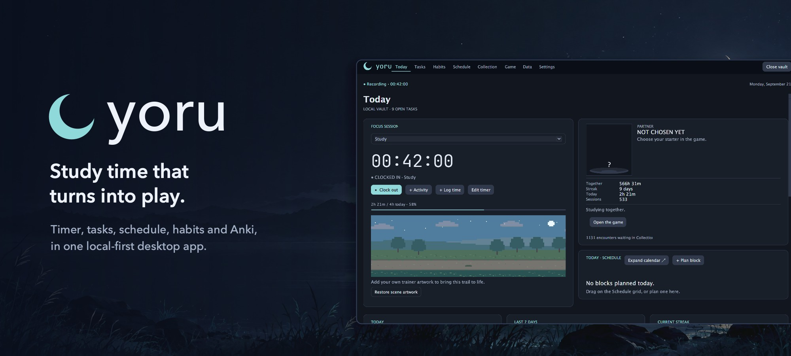
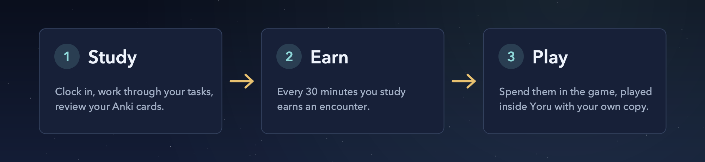
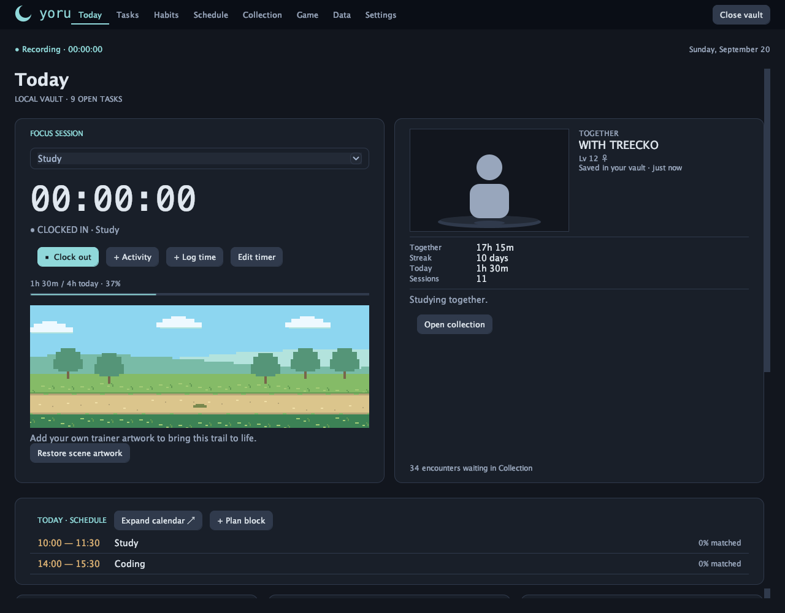
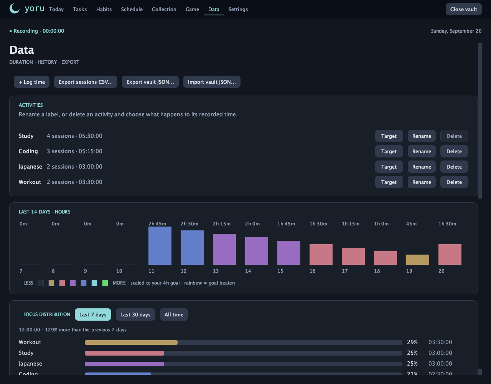
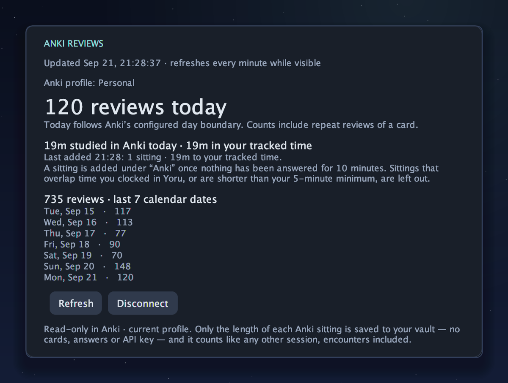
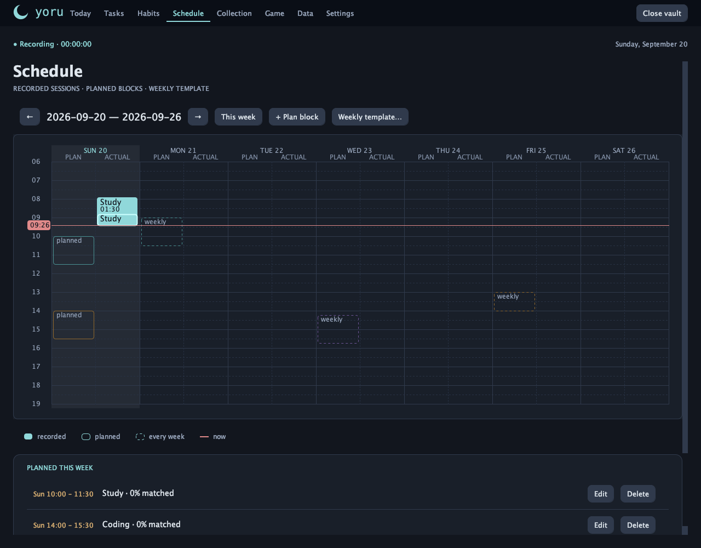
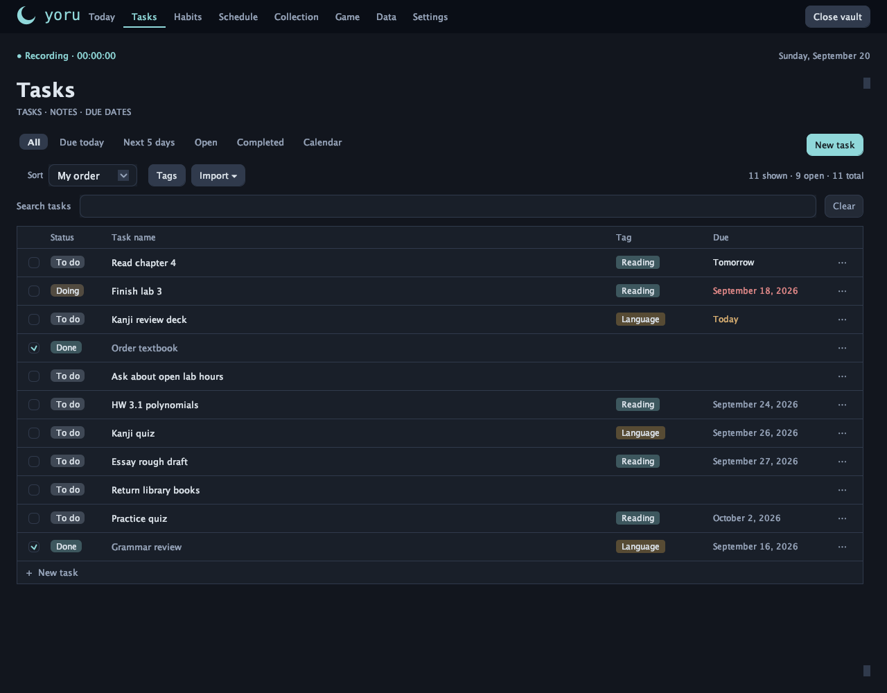
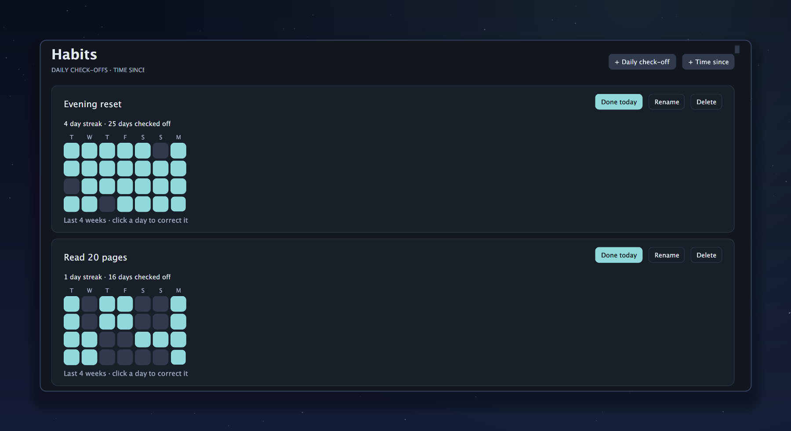
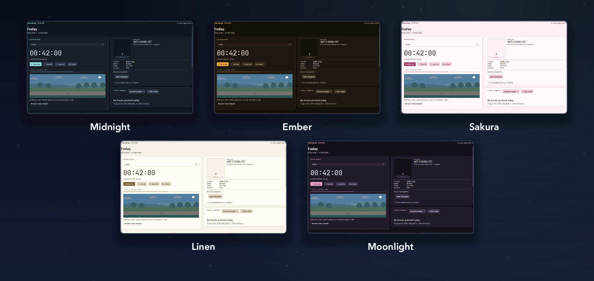

<p align="center">
  
</p>

<p align="center">
  <b>A local-first study workspace where your study time turns into play.</b><br>
  Track focus, tasks, habits and Anki reviews. Every half hour you study earns an encounter in
  <i>Pokémon Emerald</i>, which you play right inside the app with your own copy of the game.
</p>

<p align="center">
  <a href="https://github.com/Rabadakku/Yoru/releases/latest"></a>
  <a href="#install"></a>
  <a href="LICENSE"></a>
  <a href="#private-by-design"></a>
</p>

<p align="center">
  <a href="https://github.com/Rabadakku/Yoru/releases/latest"><b>Download</b></a> ·
  <a href="#features">Features</a> ·
  <a href="#the-game">The game</a> ·
  <a href="#install">Install</a> ·
  <a href="#faq">FAQ</a>
</p>

<p align="center"><sub>
Yoru is an independent fan project, not affiliated with, endorsed by or connected to Nintendo, Game Freak or The Pokémon Company.<br>
It ships no game, ROM, BIOS or artwork. You bring your own legally obtained copy.
</sub></p>

---

## How it works

<p align="center">
  
</p>

Yoru swaps the repetitive parts of the game, like walking through grass for hours or grinding
levels, for the studying you were going to do anyway. The story, the battles and the
progression stay exactly as they are.

The study tools are a complete app on their own. They never ask for a game file, and
everything below works whether you have one or not.

## Features

### ⏱️ A focus timer that stays out of your way



Clock in, clock out, and correct either one afterwards. There is no forced pomodoro. A running
timer survives closing the app, the daily goal fills as you go, and you can track as many
activities as you like. While you record, a small scene walks along beside the timer, and the
lead of your game's party can keep you company.

### 📊 A year at a glance



A 52-week heat map whose colours scale to *your* daily goal, with a rainbow tier for days that
beat it. Streaks, the last seven days and a breakdown of where your time went sit alongside it.

### 🧠 Anki counts too <sup>new in 1.0.15</sup>

<p align="center">
  
</p>

Connect Anki and every finished sitting is added to your tracked time, at the length Anki
itself reports. It reaches your totals, heat map, streak and encounters like any other session.
Yoru only reads from Anki, and never counts the same minute twice.
[Set it up →](#connect-anki)

### 🗓️ Plan the week, then see how it went



A real week grid with a plan lane and an actual lane for every day. Drag on empty space to plan
a block, drag it to move it, drag its edges to resize it, and repeat it every week. The week
starts on whichever day you choose.

### ✅ Tasks and habits

<table>
  <tr>
    <td width="50%"></td>
    <td width="50%"></td>
  </tr>
</table>

**Tasks** have due dates, a *To do → Doing → Done* status, colour tags, search, drag-to-reorder
and a month calendar you can drag them onto. Paste a list from an AI chat or import a Notion
export, and review it before anything is added. **Habits** have daily check-offs, streaks, an
editable 28-day history, and "time since" trackers for something you have quit.

### 🎨 Make it yours



Five themes, text at 100–200%, and study music from your own WAV, AIFF or AU files while the
timer runs.

### 🔒 Private by design

- **No account, no server, no sync.** Everything lives in an encrypted vault (AES-256-GCM) on
  your own computer, with an optional password.
- **Portable.** Export the whole vault as readable JSON, or your sessions as CSV, whenever you like.
- **Offline unless you ask.** The only time Yoru goes online is when you press
  *Check for updates*. Anki is read on your own computer, at `127.0.0.1`.

[SECURITY.md](SECURITY.md) explains what the vault does, and does not, protect.

## The game

The **Game** tab is the game itself, running inside Yoru. Press Play and it opens with your
save. It keeps running while you switch tabs, and Close brings your party, PC and progress
back into your vault.

- **Encounters come from your own game.** Yoru reads the wild encounter tables from your copy,
  so each encounter is something that place could really offer at that point in the story, at a
  level from that area's range. Badges open up new places, just as they do in the game. An
  encounter is decided in advance and never rerolls.
- **What you earn goes into your save,** party first and then the PC, in one crash-safe write.
  What you catch in the game comes back to Yoru the same way.
- **The battles are the game's own,** with its rosters, moves, items and rules.

**Yoru ships no game, BIOS, artwork or music, and does not download or link to any of them.**
You supply:

| | |
|---|---|
| **Your game** | Your own legally obtained copy of *Pokémon Emerald*. The reference build is *Emerald Hoenn + National Dex Edition*. |
| **The mGBA core** | Install [mGBA](https://mgba.io/)'s libretro core with [RetroArch](https://www.retroarch.com/)'s core downloader, or point Yoru at one you already have. Yoru is its own libretro frontend and never launches RetroArch. |
| **A BIOS** | Optional. mGBA emulates one when none is present. |

The Game tab finds these on first use and tells you what is missing. A missing core or game
never blocks the study tools, and each vault keeps its own save, so two workspaces never share
a journey.

<details>
<summary><b>More about the Game tab</b></summary>

**The save is the collection.** There is no starter picker and no separate roster: the party
and PC you see are read from the game's own save. While the game is closed you can move Pokémon
between boxes and the party, rename boxes and change wallpapers from Yoru, through the same
verified, backed-up transaction that delivery uses. The game and the tracker never write at
the same time; the controls turn off while the game runs.

**Artwork is optional.** Import your own supported Emerald `.gba` or `.zip` and Yoru extracts
the normal and shiny sprites and the PC wallpapers locally, on your machine.
Settings → *Extract from current game* repairs artwork for a game you already chose. You can
also drop in a folder or `.zip` of your own PNGs, or use Collection → *Choose local artwork
folder*. Without artwork, the collection shows National Dex numbers instead.

**When RetroArch is installed,** Yoru reuses that installation's mGBA core, BIOS folder and
core options.

</details>

## Install

| Platform | Download | Then |
|---|---|---|
| **macOS** (Apple silicon) | [Latest `.dmg`](https://github.com/Rabadakku/Yoru/releases/latest) | Open it and drag Yoru into Applications. |
| **Windows** | [Latest `.msi`](https://github.com/Rabadakku/Yoru/releases/latest) | Double-click it. No admin rights needed. |
| **Linux** (64-bit Intel/AMD) | [Latest `.deb`](https://github.com/Rabadakku/Yoru/releases/latest) | `sudo apt install ./<the file you downloaded>` |

Each installer carries its own Java runtime, so there is nothing else to install. On first
launch, create a workspace. A password is optional. Without one, a random key is kept beside
the vault, which is convenience rather than protection.

<details>
<summary><b>macOS says it can't verify who made Yoru</b></summary>

The macOS build is not signed with a paid Apple Developer certificate, so macOS cannot verify
who built it the first time you open it. That is expected, and it does not mean the download is
damaged. Open it once with **Control-click → Open**, then **Open** again in the dialog, or allow
it from **System Settings → Privacy & Security → Open Anyway**. After that it opens like any
other app. The whole source is right here if you would rather build it yourself.

</details>

<details>
<summary><b>Updating</b></summary>

**Settings → Updates → Check for updates** asks GitHub for the newest release, and only when you
press it. On a Mac, Yoru downloads the `.dmg`, checks it against the release's SHA-256, closes
your game and vault, replaces itself and reopens. On Windows it runs the verified `.msi` after
closing. On Linux it verifies the `.deb` and gives you the one `sudo apt install` command to run.
Versions before 1.0.5 have no updater, so install 1.0.5 or later by hand once. Your workspace
stays as it is: vaults are migrated forward and never reset.

</details>

## Connect Anki

1. In Anki, open **Tools → Add-ons → Get Add-ons**, enter **2055492159** (AnkiConnect) and
   restart Anki. See the [official AnkiConnect instructions](https://git.sr.ht/~foosoft/anki-connect).
2. Keep Anki open on the profile you want to track.
3. In Yoru, scroll to **Today → Anki reviews** and click **Connect Anki**. Enter an API key only
   if you set one in AnkiConnect.

<details>
<summary><b>How Anki time is counted</b></summary>

Answers less than ten minutes apart are one *sitting*. Once nothing has been answered for ten
minutes, the sitting is added as a session under an activity called **Anki**. It lasts as long
as the answer times Anki logged, which is the figure Anki itself reports as time studied.
Connecting catches up on the last seven days. A sitting is never added twice, and one that
overlaps time you clocked in Yoru, or is shorter than your minimum session, is left out. The
card shows Anki's minutes for today beside how many of them are in your tracked time.

Rename the Anki activity, or move a sitting to another activity, and later sittings follow the
latest one. Edit a sitting rather than deleting it: while Anki is connected, a sitting deleted
from the last week is read again and put back.

The card refreshes every minute while Today is on screen, or when you press **Refresh**. If Anki
is unavailable, the last successful snapshot stays on screen, marked with its time. Switching
Anki profiles during a refresh is refused, so collections are never mixed. **Disconnect** clears
the snapshot and the key, and so do closing or switching the vault.

Yoru reads the active profile name, review totals and the time of each answer from AnkiConnect
on `127.0.0.1:8765`. It never changes anything in Anki. The only Anki data kept in the vault is
the start and end of each sitting: no card content, answers or deck names. The API key stays in
memory for as long as the window is open. Custom ports and remote Anki instances are not
supported.

</details>

## FAQ

<details>
<summary><b>Is Yoru affiliated with Nintendo, Game Freak or The Pokémon Company?</b></summary>

No. Yoru is an independent study tracker, and is not affiliated with, endorsed by or connected
to them. "Pokémon" and related names belong to their owners, and are used here only to describe
what Yoru works with. Yoru uses no official logo, artwork, typeface or trade dress.

</details>

<details>
<summary><b>Does Yoru come with the game?</b></summary>

No. Yoru ships no ROM, save, BIOS image, artwork or music, and it does not provide, download or
link to any of them. You need your own legally obtained copy. Whether a particular copy may be
used, and on what terms, is your responsibility under the law where you live.

</details>

<details>
<summary><b>Can I use Yoru without the game?</b></summary>

Yes. The timer, tasks, schedule, habits, analytics, Anki, music from your own files and vaults
are the whole app without the game, and none of them need a game file.

</details>

<details>
<summary><b>Where is my data, and does it survive updates?</b></summary>

In an encrypted vault on your own computer: AES-256-GCM, with an optional password, and no
account or server. Vaults are migrated forward and never reset, and migration is tested against
vaults written by older builds. If you want an extra escape hatch before upgrading, export the
vault as JSON, which anything can read.

</details>

<details>
<summary><b>Why Java 22?</b></summary>

The Game tab talks to the emulator core through the JDK's foreign function API, which needs
Java 22. The installers carry their own runtime, so this only matters if you build from source.

</details>

## Build from source

Requires **JDK 22 or later**. Swing and the JDK only: no build system and no network access.

```bash
./run.sh      # build and launch
./build.sh    # compile and jar only
./test.sh     # the whole suite, headless
```

On Windows, run `build.cmd`, then `java -jar build/yoru.jar`.

<details>
<summary><b>More for contributors</b></summary>

The build produces `build/yoru.jar`, with `dev.yoru.ui.YoruApp` as its entry point.
`tools/package-installers.sh dmg|msi|deb <version>` builds an installer for the platform it
runs on. The suite covers the domain, persistence and schema migration, the Generation III save
format, encounter and delivery logic, Anki, and the rendered interface. `PrivacyTest` fails the
build if personal data or a stray image reaches a tracked file.

A few checks need things the repository never holds, such as your own libretro core and game,
or a real display, so `./test.sh` does not run them. After it has built the tests, run them by
hand:

```bash
# The core's ABI, refusing a mismatched save, Close and reopening the core.
# Starts from an invented save; your game file is only read.
java --enable-native-access=ALL-UNNAMED -cp build/classes dev.yoru.game.NativeLifecycleCheck \
     path/to/mgba_libretro path/to/game.gba path/to/empty-work-dir
# Saves Yoru writes, loaded by the game itself. Uses a copy of a save.
java --enable-native-access=ALL-UNNAMED -cp build/classes dev.yoru.game.InGameCheck \
     path/to/game.gba path/to/a-copy-of-a-save.srm path/to/empty-work-dir
# Keyboard focus in real dialogs; skipped headless.
java -ea -cp build/classes dev.yoru.ui.DialogFocusTest
```

`./test.sh` already checks every page at every text size. To look at the pages as PNGs,
`-Dtextfit.size=200` limits the run to one size:

```bash
java -Djava.awt.headless=true -Duser.home=path/to/empty-dir \
     -cp build/classes dev.yoru.ui.TextFitTest path/to/render-dir
```

The pictures in this README are drawn by `dev.yoru.ui.ReadmeMedia` from an invented vault, with
no game artwork installed:

```bash
java -Djava.awt.headless=true -Duser.home=path/to/empty-dir -Duser.timezone=UTC \
     -cp build/classes dev.yoru.ui.ReadmeMedia docs/media
```

</details>

## Contributing

Several people and AI agents work on this repository at once. **Read
[CONTRIBUTING.md](CONTRIBUTING.md) and [AGENTS.md](AGENTS.md) before pushing:** work on a
branch, never commit straight to `main`, and run `./test.sh` before you push.

- [docs/ROADMAP.md](docs/ROADMAP.md): the plan, status and what is next
- [docs/PRODUCT-GOALS.md](docs/PRODUCT-GOALS.md): the agreed study and game experience
- [docs/ARCHITECTURE.md](docs/ARCHITECTURE.md): module boundaries and the rules that keep them
- [docs/DATA-MODEL.md](docs/DATA-MODEL.md): storage; read it before touching the vault
- [SECURITY.md](SECURITY.md): the vault, and what it does not protect

## License and legal

Yoru is released into the public domain under the **[Unlicense](LICENSE)**: anyone may use it
for anything, with no conditions.

Yoru is not affiliated with, endorsed by or connected to Nintendo, Game Freak or The Pokémon
Company. It ships no game, BIOS, artwork or music. It relies on, but does not bundle,
RetroArch, the mGBA libretro core and the [pokeemerald](https://github.com/pret/pokeemerald)
decompilation, used as a reference for Generation III save and engine details. Each carries
its own licence and its own authors' credit. The full wording is in the
**[legal notice](NOTICE)**.

### Markdown pages

The Pages workspace keeps Markdown notes in the encrypted vault, with folders,
reading mode, search, page links and linked tasks. See [Pages](docs/PAGES.md)
for usage, import/export and the current feature limits.
